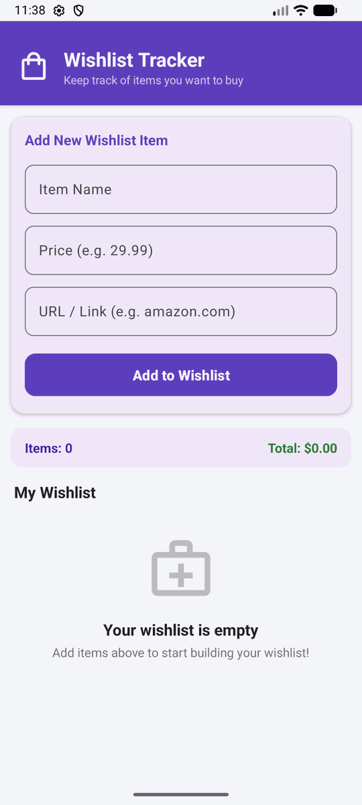

# Android Project 2 - Wishlist Tracker

Submitted by: **Marquise Phillips**

**Wishlist Tracker** is a wishlist app that helps the user keep track of what they want to buy.

Time spent: **3** hours spent in total

## Required Features

The following **required** functionality is completed:

- [x] **User can add an item to their wishlist**
- [x] **User can see their list of items based on previously inputted items**

The following **optional** features are implemented:

- [x] Wishlist app is 🎨 **customized** 🎨
- [x] User can delete an item by long pressing on the item
- [x] User can open an item's URL by clicking on the item

The following **additional** features are implemented:

* [x] **Live Summary Bar**: Dynamically calculates total item count and sum price ($).
* [x] **Input Validation**: Displays field error messages for empty inputs or invalid price formats.
* [x] **Delete Confirmation & Undo**: Dialog prompt on long-press with Snackbar Undo action.
* [x] **Empty State Screen**: Clean illustration layout shown when no wishlist items exist.

## Video Walkthrough

Here's a walkthrough of implemented user stories:

GIF created with ScreenToGif / ADB Screen Recording.

## Notes

- Ensuring edge-to-edge layout padding worked seamlessly with Material3 CardViews.
- Handled implicit intent URL resolution cleanly across different web address inputs (with or without `https://` protocol).

## License

    Copyright 2025 Student

    Licensed under the Apache License, Version 2.0 (the "License");
    you may not use this file except in compliance with the License.
    You may obtain a copy of the License at

        http://www.apache.org/licenses/LICENSE-2.0

    Unless required by applicable law or agreed to in writing, software
    distributed under the License is distributed on an "AS IS" BASIS,
    WITHOUT WARRANTIES OR CONDITIONS OF ANY KIND, either express or implied.
    See the License for the specific language governing permissions and
    limitations under the License.
